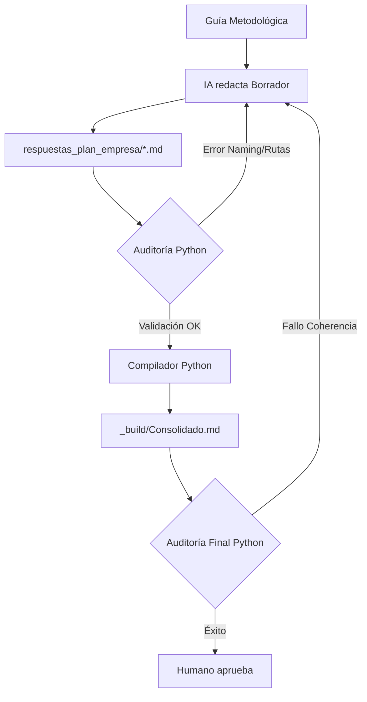

# Arquitectura Híbrida IA + Python — Sistreg

## 1. El Principio de Responsabilidad

Para garantizar la máxima calidad del Plan de Empresa y evitar errores de coherencia, el sistema se divide en tres niveles de responsabilidad:

| Actor | Responsabilidad | Acción Clave |
|---|---|---|
| **IA / Antigravity** | Criterio, narrativa y estrategia. | Redactar, proponer, interpretar y auditar semánticamente. |
| **Python / Scripts** | Determinismo, validación y consolidación. | Verificar, comparar, detectar errores técnicos y generar reportes exactos. |
| **Humano** | Decisión final y validación de negocio. | Aprobar propuestas, validar datos sensibles y autorizar cambios críticos. |

## 2. Tareas Deterministas (Misión de Python)

Las siguientes tareas NO deben depender de la memoria de la IA y serán automatizadas mediante scripts:

- **Auditoría de Naming:** Escaneo de términos prohibidos o nomenclatura antigua.
- **Validación de Estados:** Cruce de datos entre el Índice, los Gates de entrega y los archivos reales.
- **Compilación de Entregables:** Fusión de apartados en un documento único sin alteración de contenido.
- **Integridad Financiera:** Verificación de que las cifras en el texto coincidan con la fuente de verdad (Google Sheets/Excel).
- **Inventario de Anexos:** Comprobación de existencia de archivos referenciados y gráficos.

## 3. Flujo Operativo del Sistema

## 4. Roadmaps de Scripts Propuestos (Fase de Diseño)

- Python: auditoría determinista (naming de Sistreg, referencia interna de Proyecto Logístico, rutas).
- `scripts/auditar_coherencia_textual.py`: Detector de "Proyecto Logístico" (referencia interna) residual, naming incorrecto de servicios y frases de riesgo financiero.
- `scripts/auditar_estado_plan_empresa.py`: Comprobador de Gates vs Realidad.
- `scripts/compilar_plan_empresa.py`: Generador del documento único consolidado.
- `scripts/generar_graficos_financieros.py`: Extractor de datos de Google Sheets para crear visualizaciones PNG consistentes.
- `scripts/auditar_anexos_y_graficos.py`: Validador de rutas y existencia de soporte documental.

## 5. Lo que NO debe hacer Python
- No debe redactar contenido narrativo ni proponer estrategia de negocio.
- No debe corregir contenido automáticamente sin reportar el error (debe bloquear, no "imaginar" la solución).

## 6. Lo que NO debe hacer la IA
- No debe ser la única fuente de validación de rutas o nombres prohibidos.
- No debe realizar cálculos complejos o proyecciones financieras sin verificación determinista.
